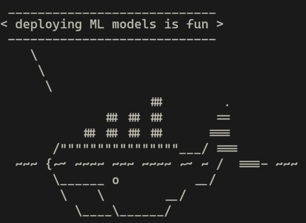

# Introdução ao Docker e Instalação

Neste laboratório e em outros posteriores, você aprenderá diferentes técnicas que permitirão implantar modelos de aprendizado de máquina.

Há uma lacuna de conhecimento entre o treinamento bem-sucedido de um modelo em um ambiente local e a sua utilização efetiva..  

---------
## Docker
Utilizaremos muito o [Docker](https://www.docker.com/) por isso **será necessário que você execute o código em seu computador local**.

### Porquê Docker?

O Docker é uma ferramenta incrível que permite que você **transporte seu software junto com todas as suas dependências**. Isso é ótimo porque permite que você execute o software mesmo sem instalar os interpretadores ou compiladores necessários para que ele seja executado.

Vamos usar um exemplo para explicar isso melhor:

Suponha que você tenha treinado um modelo de deep learning usando Python junto com algumas bibliotecas, como Tensorflow ou JAX. Para isso, você criou um ambiente virtual em sua máquina local. Tudo funciona bem, mas agora você quer compartilhar esse modelo com um colega seu que não tem o Python instalado, muito menos qualquer uma das bibliotecas necessárias.

Em um mundo pré-Docker, seu colega teria que instalar todo esse software apenas para executar seu modelo. Em vez disso, ao instalar o Docker, você pode compartilhar uma imagem do Docker que inclua todo o seu software e isso será tudo o que será necessário.

### Alguns conceitos-chave

Você acabou de ler sobre as imagens do Docker e pode estar se perguntando o que elas são. Agora você será apresentado a três conceitos fundamentais para entender como o Docker funciona. Eles são **Dockerfiles**, **imagens** e **contêineres**, e serão explicados nesta ordem, pois cada um deles usa os anteriores.

- `Dockerfile`: Esse é um arquivo especial que contém todas as instruções necessárias para criar uma imagem. Essas instruções podem ser qualquer coisa, desde "instalar o Python versão 3.7" até "copiar meu código dentro da imagem".

- `Image`: Isso se refere à coleção de todo o seu software em um único local. Usando o exemplo anterior, a imagem incluirá Python, Tensorflow, JAX e seu código. Isso será obtido definindo-se as instruções apropriadas no Dockerfile.

- `Container`: Essa é uma instância em execução de uma imagem. As imagens por si só não fazem muito além de salvar as informações de seu código e suas dependências. É necessário executar um contêiner a partir delas para realmente executar o código dentro delas. Em geral, os contêineres são destinados a executar uma única tarefa, mas podem ser usados como runtime para executar softwares que você não instalou.

Agora que você tem uma ideia de alto nível de como o Docker funciona, é hora de instalá-lo. Se já o tiver instalado, pode pular a maioria dos itens a seguir.

------
## Instalação

Para instalar a versão gratuita do Docker, acesse este [link](https://www.docker.com/products/docker-desktop). 

----
## Testando a instalação do Docker

Para testar sua instalação, vá para a linha de comando e digite o seguinte comando:
```bash
docker run --rm docker/whalesay cowsay "deploying ML models is fun"
```
This command will try to run the `docker/whalesay` image. Since you probably don't have this image installed, Docker will look for it in the [Docker Hub](https://hub.docker.com/) and pull it to your machine to run it. If everything worked well you should see the following image printed in your command line:



If you think of a funny thing for the Docker whale to say be sure to replace the message above with it and send the image to your friends.

If the command didn't work try following the previous steps again.

-----
### Check your curl installation

Another tool that you will be using during these labs is [curl](https://curl.se/) so be sure to check that it is installed. To do so use the following command:
```bash
curl -V
```

If the `curl` command is not recognized then you can install it on a Debian-based Linux (like Ubuntu) machine with this command:

```bash
apt-get install curl
```

If you are on other OS like Mac, look up on google how to install it, it should be pretty straightforward.

`curl` is just an HTTP client, if you prefer other or an app with a graphical interface instead of the command line you can use something like [postman](https://www.postman.com/).

Now you are ready to complete the rest of ungraded labs in this course! **Nice job!**