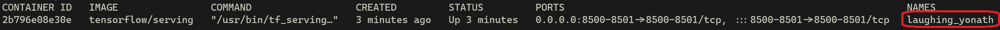

Adaptado de [Machine Learning in Production](https://www.deeplearning.ai/courses/machine-learning-in-production/) de [Andrew Ng](https://www.deeplearning.ai/)  ([Stanford University](http://online.stanford.edu/), [DeepLearning.AI](https://www.deeplearning.ai/))


# Primeira olhada no *Tensorflow Serving* com o Docker

Nesse laboratório você dará uma olhada no uso do [Tensorflow Serving](https://www.tensorflow.org/tfx/guide/serving)(TFS) com o Docker. Essa é uma das maneiras mais fáceis de conhecer esse incrível sistema de serviço para modelos de aprendizado de máquina, pois a imagem já contém todas as dependências e configurações necessárias para executar o TFS imediatamente.

Neste laboratório, você usará o TFS para implantar um modelo fictício de aprendizado de máquina localmente. Este laboratório é inspirado neste [tutorial oficial](https://www.tensorflow.org/tfx/serving/docker).

Abra seu terminal (ou shell) e vamos começar!

----------------------

## Extração da imagem

Comece extraindo a imagem do Docker do TFS do hub do Docker:

```bash
docker pull tensorflow/serving
```
Essa é a imagem mais minimalista em que você pode executar o TFS. Ela contém todas as dependências necessárias para executar o TFS e foi criada tendo em mente favorecer o tamanho da imagem. Como resultado, ela tem cerca de 400 MB.

## Clonar o repositório com o modelo fictício


Agora você clonará o [repositório oficial do TFS](https://github.com/tensorflow/serving), que contém um modelo fictício chamado `Half Plus Two` que retorna `0.5 * x + 2` para qualquer valor de `x`. 

Você fará a clonagem no diretório temporário do seu sistema de arquivos para que sua máquina não fique desorganizada. 

Execute os três comandos a seguir:

```bash
mkdir -p /tmp/tfserving

cd /tmp/tfserving

git clone https://github.com/tensorflow/serving
```

Esses comandos executam essas operações em ordem:
- Criar um diretório chamado `tfserving` no diretório temporário `/tmp`.
- Alterar seu diretório atual para o que acabou de ser criado
- Clonar o repositório nesse local

Depois de executar esses comandos, você pode retornar ao diretório anterior usando `cd -` ou pode simplesmente fechar essa janela de linha de comando.

## Executar o serviço do Tensorflow

Como a imagem que você acabou de extrair contém todo o software necessário para executar o modelo no TFS, tudo o que resta é executar um contêiner a partir da imagem.

Um `docker run` simples tem a seguinte aparência:

```bash
docker run name-of-the-image
```
No entanto, você pode especificar *flags* diferentes para obter funcionalidades diferentes. Você verá como isso funciona daqui a pouco.

Dê uma olhada no comando que ativará um contêiner para servir o modelo no TFS:

```bash
docker run --rm -p 8501:8501 \
  --mount type=bind,\
source=/tmp/tfserving/serving/tensorflow_serving/servables/tensorflow/testdata/saved_model_half_plus_two_cpu,\
target=/models/half_plus_two \
  -e MODEL_NAME=half_plus_two -t tensorflow/serving &
```

Aqui tem um monte de informação, né? Então vamos dividi-la para entender o que cada flag está fazendo:

- `--rm`: Excluir esse contêiner depois de parar de executá-lo. Isso evita a necessidade de excluir manualmente o contêiner. A exclusão de contêineres não utilizados ajuda seu sistema a permanecer limpo e organizado.

- `-p 8501:8501`: Esse flag executa uma operação conhecida como **mapeamento de porta**. O contêiner, assim como sua máquina local, tem seu próprio conjunto de portas. Para acessar a `port 8501` no contêiner, é necessário **mapeá-la** para uma porta no seu computador. Nesse caso, ela é mapeada para a `port 8501` em seu computador. Essa porta foi escolhida por ser a porta padrão para interagir com o modelo por meio de uma `REST API`. Se você estiver usando um protocolo diferente, como o [`gRPC`](https://grpc.io/), precisará usar a `porta 8500`. Mais informações sobre isso no [tutorial](https://www.tensorflow.org/tfx/serving/docker) mencionado no início do laboratório.
- `--mount type=bind,source=dir/in/your/pc,target=dir/in/container`: Esse flag permite **montar** um diretório no seu PC em um diretório dentro do contêiner. Isso é muito importante porque os contêineres geralmente têm vida útil curta e, sem montar arquivos neles, não há como manter as alterações feitas nesses arquivos quando o contêiner estava em execução.

- `-e MODEL_NAME=half_plus_two`: Criará a variável de ambiente `MODEL_NAME` e atribuirá a ela o valor de `half_plus_two`.
- `-t`: Anexa um pseudo-terminal ao contêiner para que você possa verificar o que está sendo impresso nos fluxos padrão do contêiner. Isso permitirá que você veja os logs impressos pelo TFS.

Depois de executar esse comando, o TFS será ativado e hospedará o modelo `Half Plus Two`.

-------

## Consumindo o modelo

Agora que o modelo está sendo servido na `port 8501`, você pode usar um cliente HTTP para obter previsões dele. A seguir, será mostrado como fazer isso com o `curl`, mas fique à vontade para usar qualquer cliente de sua escolha.

Como você precisa fornecer alguns dados que serão processados pelo servidor, deve usar uma solicitação `HTTP POST`.

Vamos fazer a inferência de um lote de três números, abrir uma nova janela ou guia de linha de comando e executar o seguinte comando:

```bash
curl -d '{"instances": [1.0, 2.0, 5.0]}' \
  -X POST http://localhost:8501/v1/models/half_plus_two:predict
```

Assim como no comando `docker run`, vamos detalhar os flags desse comando:
- `-d`: O `d` significa data (dados). Esses são os dados que você enviará ao servidor para que ele os processe. Como você está se comunicando com o modelo via `REST`, deve fornecer os dados em um formato `JSON`. O TFS tem a convenção de que a **key** desse objeto deve ser a string `instances` e o **value** deve ser uma lista que contém cada ponto de dados para o qual você deseja fazer inferência.
- `-X`: Esse sinalizador permite que você especifique o método `HTTP` desejado. Por padrão, o `curl` usa o método `GET`, mas, nesse caso, ele deve ser `POST`.


O último parâmetro do comando é o `URL` para o qual ele deve fazer a solicitação. Vamos detalhar o `URL` também:
- `http://localhost:8501`: Representa sua própria máquina na porta 8501, como você especificou anteriormente.
- `v1`: Refere-se à versão do TFS utilizada. No momento, essa parte do `URL` será sempre `v1`.
- `models/half_plus_two`: Essa parte se refere ao modelo que deve ser servido. Como você definiu a variável de ambiente `MODEL_NAME` para ter o valor `half_plus_two`, esse é o nome do modelo.
- `predict`: Permite que o TFS saiba que o modelo será usado para inferência (ou previsão).

Depois de executar a solicitação, você deverá receber uma solicitação com a previsão para cada um dos três números que você enviou.

-----

## Parar o servidor

Por fim, você aprenderá a parar o servidor em execução no contêiner do Docker. Nesse caso, parar o contêiner é equivalente a parar o servidor. Para isso, execute o seguinte comando para ver todos os processos (ou contêineres) do Docker em execução:

```bash
docker ps
```
Isso exibirá algumas informações relevantes para cada processo do docker em execução. Se quiser verificar essas informações também para os contêineres parados, use o flag `-a`.

O Docker atribui automaticamente um nome exclusivo a cada contêiner e isso pode ser visto com o comando acima, que deve gerar uma saída semelhante a esta:



Para parar um contêiner, basta usar o comando:

```bash
docker stop container_name
```

Nesse caso, o comando será: 
```bash
docker stop laughing_yonath
```

Após alguns segundos, você verá que o processo foi encerrado no terminal em que o contêiner foi aberto.

-----
**Parabéns por terminar este laboratório!**

Agora você deve ter uma noção melhor de como o Docker pode ser aproveitado para atender aos seus modelos de aprendizado de máquina. Você também deve entender melhor como usar o comando `docker run` para ativar contêineres e como usar o `curl` para interagir com servidores da Web.

Este laboratório usou um modelo fictício, mas nos próximos laboratórios você verá esse processo com modelos reais e outros recursos do TFS.

**Continue assim!**

Siga agora para o laboratório [Servir um modelo com o TensorFlow Serving](https://colab.research.google.com/github/fabiobento/deploy_mlops/blob/main/1%20-%20Servi%C3%A7o%20de%20modelo-introdu%C3%A7%C3%A3o/week1-ungraded-labs/C4_W1_Lab_3_TFS.ipynb)