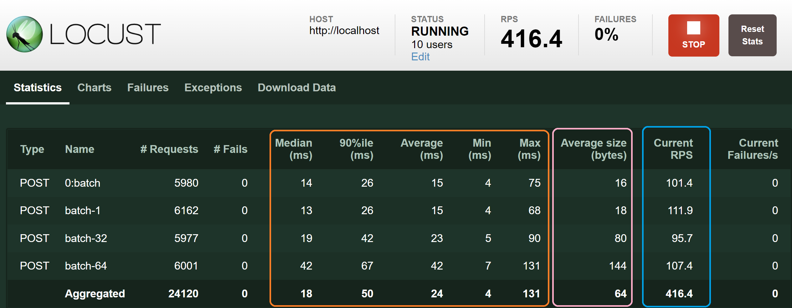

Adaptado de [Machine Learning in Production](https://www.deeplearning.ai/courses/machine-learning-in-production/) de [Andrew Ng](https://www.deeplearning.ai/)  ([Stanford University](http://online.stanford.edu/), [DeepLearning.AI](https://www.deeplearning.ai/))

# Servidores de teste de carga com Docker Compose e Locust

Durante este laboratório você realizará um teste de carga nos servidores que codificou em um laboratório anterior. Você comparará a latência em quatro servidores:
- O servidor que não oferece suporte a lotes
- O servidor com lotes e usando:
    - lotes de 1 
    - lotes de 32
    - lotes de 64

Tecnicamente, há apenas dois servidores (o que tem e o que não tem lotes), mas, por uma questão de praticidade, você os considerará como servidores separados, uma vez que eles manipularão quantidades diferentes de dados.

Para isso, você usará o [Locust](https://locust.io/), que é uma excelente ferramenta de teste de carga de código aberto, e o [Docker Compose](https://docs.docker.com/compose/), que permite executar aplicativos com vários contêineres.

Você rodará um total de 5 contêineres, 4 para cada um dos servidores mencionados anteriormente e 1 que executará o Locust para que não seja necessário instalá-lo. Antes de prosseguir, abra uma janela de terminal e execute o seguinte comando para fazer o download da imagem do Locust:

```bash
docker pull locustio/locust
```

Você também deve ter as imagens `mlepc4w2-ugl:no-batch` e `mlepc4w2-ugl:with-batch` que você criou durante o laboratório anterior. **Antes de prosseguir, verifique se você tem essas duas imagens, bem como a imagem `locustio/locust:latest`**. Você pode verificar novamente usando o seguinte comando:
```bash
 docker images
```
Abra um terminal e acesse o diretório que contém os arquivos necessários para este laboratório. Supondo que você esteja na raiz do repositório, use o comando:
```bash
cd 2\ -\ Servir\ modelo-padrões\ de\ infraestrutura/week2-ungraded-labs/C4_W2_Lab_3_Latency_Test_Compose/
```

Vamos começar!

-----

## Por que e como usar o Docker Compose

Você poderia ativar manualmente os 5 contêineres, mas precisará encontrar uma maneira de vinculá-los por meio de uma rede. Isso pode ser feito usando comandos regulares do Docker, mas é muito mais fácil de realizar usando o Docker Compose. 

Em vez de executar cada contêiner em uma janela de terminal separada, você pode simplesmente definir um arquivo de configuração no formato `YAML` e usar o comando `docker-compose up` para executar seu aplicativo com vários contêineres. Caso você nunca tenha trabalhado com arquivos `YAML`, eles geralmente são para configuração e funcionam de forma semelhante ao Python, usando indentação para especificar o escopo.

Vamos dar uma olhada no início do arquivo `docker-compose.yml`:
```yml
version: "3.9"
services:
  no-batch:
    image: mlepc4w2-ugl:no-batch
    links:
      - locust
```

A primeira linha especifica a versão do formato Compose que está sendo usada. No momento em que este tutorial foi escrito, a versão mais recente era a 3.9, portanto, esse é o formato selecionado. Observe que as versões mais recentes do Compose não exigem que isso seja explicitamente declarado, mas é algo bastante comum, portanto vale a pena entender seu significado.

Depois disso, você definirá cada um dos seus `serviços` (ou contêineres). Você especificará o nome do serviço (neste caso, `no-batch`) juntamente com as informações necessárias para executá-lo. Nesse caso, esse é o servidor que não oferece suporte a lotes, portanto, um contêiner que usa a imagem `mlepc4w2-ugl:no-batch` deve ser usado. Observe o item `links`, que é usado para informar ao Compose que esse serviço precisará se comunicar com o serviço chamado `locust` por meio da rede que o Compose criará. 

Para entender melhor isso, dê uma olhada no arquivo `docker-compose.yml` completo:
```yml
version: "3.9"
services:
  no-batch:
    image: mlepc4w2-ugl:no-batch
    links:
      - locust
  batch-1:
    image: mlepc4w2-ugl:with-batch
    links:
      - locust
  batch-32:
    image: mlepc4w2-ugl:with-batch
    links:
      - locust
  batch-64:
    image: mlepc4w2-ugl:with-batch
    links:
      - locust
  locust:
    image: locustio/locust
    ports:
      - "8089:8089"
    volumes:
      - ./:/mnt/locust
    command: -f /mnt/locust/locustfile.py
```

Cada um dos quatro servidores que lidam com previsões precisa ser vinculado ao serviço locust para que você possa executar o teste de carga. Observe que os servidores que oferecem suporte a lotes têm informações idênticas, exceto pelo nome do serviço. 

O serviço locust tem mais algumas coisas acontecendo, mas a essa altura você já viu como eles funcionam:

- Primeiro, esse contêiner terá a porta 8089 mapeada para a porta 8089 em seu host local. Isso serve para que você possa acessar o serviço diretamente. 

- Há também um volume, que é muito semelhante às montagens bind que você viu nos laboratórios anteriores. Isso permite que você monte arquivos no seu sistema de arquivos local no contêiner. Geralmente, ele é usado para manter as alterações, mas, nesse caso, é feito para que você não precise criar uma nova imagem que use a imagem `locustio/locust` como base e copie o `locustfile.py` dentro da imagem. 

- Por fim, o item `command` é análogo à instrução `CMD` e se refere ao comando que será executado quando o contêiner for ativado; nesse caso, o servidor locust é iniciado para realizar o teste de carga.

Antes de iniciar esse aplicativo de vários contêineres, vamos dedicar algum tempo para entender como o `locust` funciona em alto nível.

## Entendendo o Locust

Por convenção, o arquivo que lida com a lógica do locust é denominado `locustfile.py`. Ao contrário dos Dockerfiles, esse arquivo é um script python comum. Lembre-se de que você pode dar uma olhada no arquivo completo neste repositório.

O funcionamento do locust consiste em simular usuários que enviarão constantemente solicitações aos seus serviços. Ao fazer isso, você pode medir coisas como `RPS` (solicitações por segundo) ou o tempo médio que cada solicitação está levando. **Isso é ótimo para entender as limitações de seus servidores e testar se eles funcionarão nas circunstâncias em que estarão expostos quando forem lançados em produção.**

O uso do locust é, na verdade, bastante simples. Primeiro, você precisa criar uma nova classe que herde de `locust.HttpUser` e, dentro dessa classe, especificar um método para cada serviço que deseja testar. Essas funções devem ser decoradas com o decorador `locust.task`. 

Dê uma olhada em como isso se parece:
```python
class LoadTest(HttpUser):
    wait_time = constant(0)
    host = "http://localhost"

    @task
    def predict_batch_1(self):
        request_body = {"batches": [[1.0 for i in range(13)]]}
        self.client.post(
            "http://batch-1:80/predict", json=request_body, name="batch-1"
        )
```

Observe as duas variáveis `wait_time` e `host`, vamos esclarecê-las rapidamente: 

- `wait_time` informa ao locust quanto tempo deve ser aguardado entre cada solicitação; nesse caso, você deseja que ele envie solicitações o mais rápido possível para ver o desempenho dos servidores em condições extremas. A função constante é, na verdade, `locust.constant`.

- O `host` especifica o host onde o serviço que está sendo testado está hospedado. Normalmente, o Locust é destinado a testar vários pontos de extremidade no mesmo host, mas, neste caso, estamos testando quatro servidores diferentes localizados em quatro hosts diferentes. Nesse caso, o padrão do `host` é 
`http://localhost`, mas, na verdade, você especificará cada host nas funções de tarefa, de modo que esse parâmetro não faz nada, mas é exigido pelo locust, portanto, você precisa especificar algum valor.

Agora vamos entender o método de tarefa para testar o servidor que manipulará lotes de 1 ponto de dados. Esse é um método da classe `LoadTest`, portanto, ele deve ter `self` como parâmetro. 

Nesse caso, você não está interessado nas previsões reais do servidor, portanto, definirá um lote genérico de dados contendo apenas 1. Use essa lista de listas (que é o que o servidor espera) para criar um dicionário e passá-lo como `JSON` ao fazer a solicitação `POST`. A solicitação é feita usando a função `self.client.post`. Observe a URL que é passada para essa função, que é `http://batch-1:80/predict`. 

Lembre-se de que todos os servidores escutam na porta `80` de seus respectivos contêineres e o modelo é hospedado no ponto de extremidade `/predict`. **Algo muito importante é o nome do host utilizado; nesse caso, é `batch-1`, que é o nome que você deu ao serviço que lidará com lotes de 1 no arquivo `docker-compose.yml`.

Os métodos para testar os outros servidores são praticamente idênticos a esse, exceto pelo URL usado e pelos dados passados para a solicitação. Dê uma olhada no `locustfile.py` completo:

```python
from locust import HttpUser, task, constant


class LoadTest(HttpUser):
    wait_time = constant(0)
    host = "http://localhost"

    @task
    def predict_batch_1(self):
        request_body = {"batches": [[1.0 for i in range(13)]]}
        self.client.post(
            "http://batch-1:80/predict", json=request_body, name="batch-1"
        )

    @task
    def predict_batch_32(self):
        request_body = {"batches": [[1.0 for i in range(13)] for i in range(32)]}
        self.client.post(
            "http://batch-32:80/predict", json=request_body, name="batch-32"
        )

    @task
    def predict_batch_64(self):
        request_body = {"batches": [[1.0 for i in range(13)] for i in range(64)]}
        self.client.post(
            "http://batch-64:80/predict", json=request_body, name="batch-64"
        )

    @task
    def predict_no_batch(self):
        request_body = {
            "alcohol": 1.0,
            "malic_acid": 1.0,
            "ash": 1.0,
            "alcalinity_of_ash": 1.0,
            "magnesium": 1.0,
            "total_phenols": 1.0,
            "flavanoids": 1.0,
            "nonflavanoid_phenols": 1.0,
            "proanthocyanins": 1.0,
            "color_intensity": 1.0,
            "hue": 1.0,
            "od280_od315_of_diluted_wines": 1.0,
            "proline": 1.0,
        }
        self.client.post(
            "http://no-batch:80/predict", json=request_body, name="0:batch"
        )
```

Agora que você entende como o locust funciona, finalmente chegou a hora de realizar testes de carga em seus servidores!

## Teste de carga dos servidores

Verifique se você está no mesmo diretório dos arquivos `locustfile.py` e `docker-compose.yml` e execute o seguinte comando:

```bash
docker compose up
```

O Docker Compose ativará automaticamente todos os seus serviços e criará uma rede para que eles se comuniquem. Não é bacana?

Agora vá para [http://localhost:8089/](http://localhost:8089/) e você verá a interface do locust. Aqui você pode selecionar a quantidade de usuários que deseja, bem como a taxa de geração (quantos novos usuários por segundo são adicionados até atingir a quantidade total desejada).

**Comece com valores baixos, pois quanto mais usuários forem adicionados, mais memória será necessária e você corre o risco de travar o aplicativo.** Um bom ponto de partida é 10 usuários e 10 de *Spawn rate*. 

Agora, clique no botão `Start swarming` e o teste de carga será iniciado. Você verá um painel com a seguinte aparência:



Cada linha corresponde a um serviço que você está testando. Você pode saber qual é qual observando o nome (eles foram definidos no `locustfile.py`). 

As duas primeiras colunas mostram o número de solicitações enviadas a cada servidor e o número de solicitações que falharam.

As próximas cinco colunas (destacadas em laranja) mostram algumas estatísticas descritivas sobre a latência dos servidores em milissegundos. 

A próxima coluna (destacada em rosa) mostra a quantidade média de bytes que está sendo processada pelo servidor com cada solicitação. Observe que quanto maiores os lotes, maior será esse número.

A próxima coluna (destacada em azul) mostra o `RPS` de cada servidor. Nesse caso, essa métrica não é a mais confiável, pois o locust tenta enviar a mesma quantidade de tráfego para cada serviço, mas há alguma variação nesse processo. Por esse motivo, é melhor tomar decisões com base nas informações de latência, que são independentes da quantidade de solicitações.

Agora é sua vez de brincar um pouco mais com isso. Para interromper o teste atual, clique no botão `Stop` no canto superior direito da tela. Agora você pode enviar novos valores para o Número de usuários e a Taxa de geração. Você deve estar seguro usando valores de até 500, portanto, experimente alguns valores diferentes e veja o resultado!

## Interromper o aplicativo

Quando terminar este laboratório, vá para a janela do terminal onde executou o comando `docker compose up` e use a combinação de teclas `ctrl + c` uma vez para interromper o aplicativo de vários contêineres. 

Nesse ponto, os contêineres foram interrompidos, mas não removidos. Para removê-los juntamente com a rede que foi criada, use o comando `docker compose down`.

----
**Parabéns por ter concluído este laboratório!**

Neste laboratório, você viu como usar o Docker Compose para executar aplicativos com vários contêineres definindo um arquivo de configuração no formato `YAML`. Essa é uma alternativa muito melhor do que rodar e vincular os contêineres manualmente, pois ele cuida da maior parte disso para você. Você também foi exposto ao Locust e como ele pode ser aproveitado para realizar testes de carga em seus servidores.

Agora você deve ter uma compreensão mais clara de como usar essas ferramentas para criar serviços prontos para produção que suportarão as condições às quais serão expostos quando forem implantados no mundo externo.

**Continue assim!**
